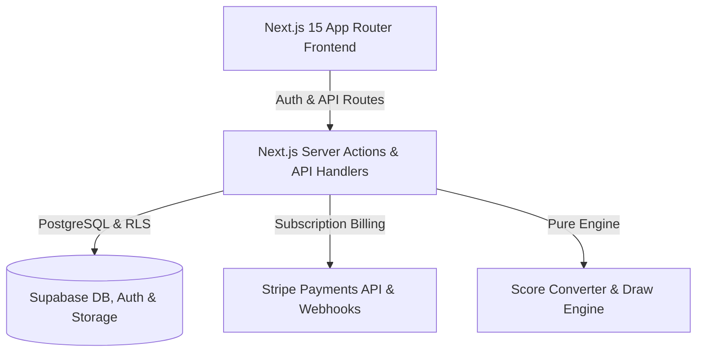

# Platform Architecture Specification

System architecture and module design for **Digital Heroes** — a subscription-based charity and golf Stableford score monthly draw platform.

---

## 1. High-Level Architecture Diagram

---

## 2. Core Modules Summary

- **App Router Layout (`src/app/`)**: Responsive pages with server-side protection guards (`/dashboard/*`, `/admin/*`).
- **Score-to-Number Converter (`src/lib/draw/score-converter.ts`)**: Pure function translating rolling 5 scores (1–45) to 5 draw numbers with wraparound (+1) collision handling.
- **Draw & Financial Engine (`src/lib/draw/engine.ts`)**: Manages prize pool minor currency integer math, 40%/35%/25% tier allocation, winner splitting, 5-number jackpot rollover, and 3/4-number undistributed tracking.
- **Stripe Subscriptions (`src/lib/stripe.ts` & `/api/stripe/*`)**: Server-side checkout session creation, customer portal, raw request body webhook verification, and idempotency.
- **Local Demo Mode (`src/lib/demo-mode.ts`)**: Automatic fallback when Supabase/Stripe keys are unconfigured (strictly disabled in production).
